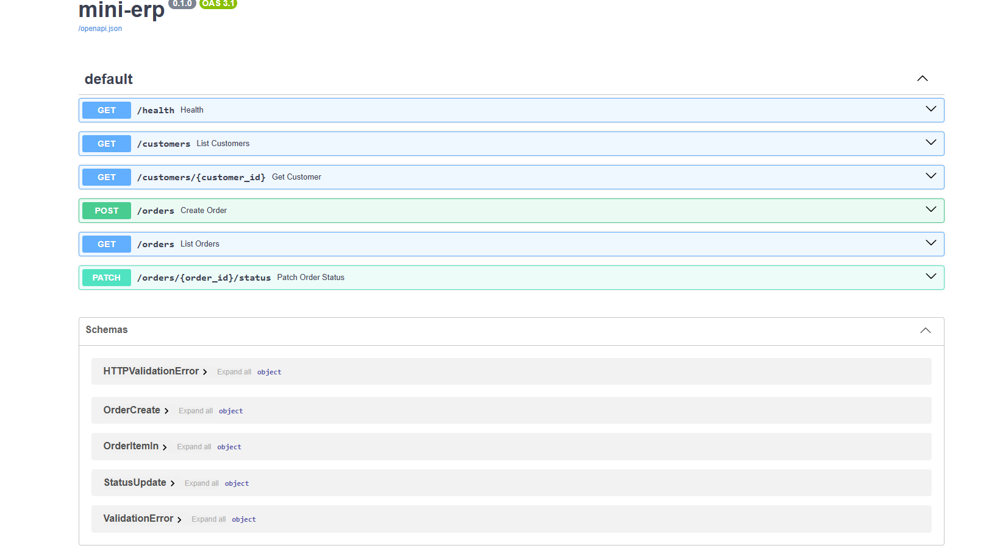

# mini-erp

A small order-management API — customers, orders, and line items — built over SQLite with FastAPI. Written as a learning project to understand REST APIs from the *serving* side rather than the calling side: routing, request validation, status codes, and self-documenting specs.

The data layer (`orders_db.py`) knows nothing about HTTP. The API layer (`main.py`) knows nothing about SQL. Swapping SQLite for Postgres would touch one file.

## Authentication

All data endpoints require an `x-api-key` header. `/health` is intentionally open
so monitoring can reach it without holding a credential.

Set the key before starting the server (per terminal):

```powershell
$env:MINI_ERP_API_KEY = "your-key-here"
fastapi dev main.py
```

Then either send the header directly:

```powershell
curl.exe -H "x-api-key: your-key-here" http://127.0.0.1:8000/customers
```

...or click **Authorize** at the top of `/docs` and paste the key once.

## Running it

```
python -m venv .venv
.venv\Scripts\Activate.ps1        # Windows PowerShell
pip install -r requirements.txt
python orders_db.py               # creates and seeds orders.db
fastapi dev main.py
```

Then open http://127.0.0.1:8000/docs

## Endpoints

| Method | Path | Description |
|--------|------|-------------|
| GET | `/health` | Liveness check. Touches no database. |
| GET | `/customers` | All customers. |
| GET | `/customers/{customer_id}` | One customer. 404 if absent. |
| GET | `/orders` | All orders. Optional `?customer_id=` and `?status=` filters. |
| POST | `/orders` | Create an order with line items. Returns 201. |
| PATCH | `/orders/{order_id}/status` | Move an order to pending / shipped / cancelled. |

## Interactive docs



FastAPI generates an OpenAPI spec from the type hints in `main.py` and renders it at `/docs`. Nothing on that page is hand-written — the raw spec is at `/openapi.json`.

## A design decision worth explaining

The request model for creating an order deliberately omits two columns that exist in the `orders` table: `order_id` and `status`.

`order_id` is left out because identity is the system's to assign, not the caller's — two clients choosing the same id on the same afternoon is a data problem no amount of validation fixes. `status` is left out because a new order is always `pending`, and the airtight way to enforce that is to not offer the field. A default is a suggestion; an absent field is a rule.

The consequence is that the input model and the stored row are different shapes on purpose. `OrderCreate` describes what a caller is *allowed to say*; the `orders` table describes what is *true*.

## Error handling

| Status | When |
|--------|------|
| 422 | Request body or query parameter fails validation. Handled by Pydantic before any endpoint code runs. |
| 404 | A customer or order referenced by path does not exist. |
| 400 | The request is well-formed but violates a business rule — e.g. an order for a customer that does not exist, caught as a foreign-key `IntegrityError`. |
| 201 | Order created. |

A search that matches nothing (`/orders?customer_id=999`) returns `200` with an empty array, not a 404 — a valid question with no results is not a missing resource.

## Notes

- Line-item prices are stored as `REAL`. Real systems use integer cents or a decimal type; floats cannot represent money exactly.
- Filtering happens in SQL, not in Python, so the database returns only matching rows.
- Every query is parameterized (`?` placeholders), never f-string interpolated.
